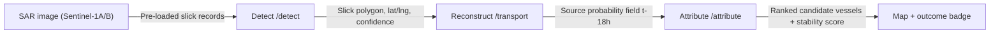
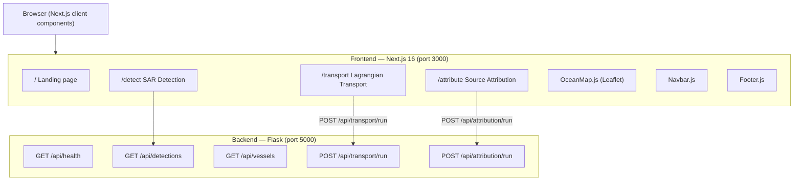

# OceOrigin

A hackathon prototype for marine oil-spill detection, Lagrangian transport reconstruction, and vessel source attribution using satellite SAR data.

---

## Overview

**OceOrigin** demonstrates a three-stage pipeline for investigating marine oil-spill incidents:

1. **Detect** — Display and characterise oil-slick candidates derived from Sentinel-1 SAR imagery (extent, orientation, morphology, confidence).
2. **Reconstruct** — Run an ensemble backward-particle simulation to generate a source-probability field over 18 hours of back-trajectory.
3. **Attribute** — Intersect that probability field with historical AIS vessel tracks and run a stability-aware perturbation test to rank candidate vessels.

The problem it addresses: when a satellite detects an oil slick at sea, it is not obvious *which* vessel discharged it, or *when* and *where* the discharge took place. OceOrigin structures the evidence chain — from the observed slick backward through ocean physics to a ranked set of candidate ships — in a single interactive web interface.

This is a **hackathon prototype** (Smart India Hackathon 2026, Team MAD-PALs). All simulation results in the current build are physics-inspired mock data; no live satellite feeds or live AIS streams are connected.

---

## Key Features

- **Landing page** with an animated radar-orb hero, a four-stage pipeline stepper, and module cards linking to each tool.
- **SAR Detection module** (`/detect`): browse a log of three pre-loaded slick records (SLK-2447-A, SLK-2441-B, SLK-2439-C); each shows a simulated SAR view with a scan-line animation, polygon overlay, measurement lines, and a full metadata grid (area, dimensions, confidence, morphology, orientation, status).
- **Lagrangian Transport module** (`/transport`): configure and run an 8-scenario ensemble backward simulation with per-scenario progress tracking, an animated particle canvas, a timeline scrubber (t−18 h), and source-probability zones.
- **Source Attribution module** (`/attribute`): run an 8-run stability test across three candidate vessels, view per-run scenario logs, an interactive Leaflet map with vessel tracks and slick polygon, attribution-score ring charts, and ROBUST / COMPETING / UNRESOLVED outcome badges.
- **Interactive Leaflet map** showing the observed-slick polygon, concentric source-probability heatmap rings, colour-coded vessel position markers, and historical AIS track polylines.
- **Responsive dark-mode UI** with a fixed navbar (scroll-blur effect, mobile hamburger), footer with a live UTC clock, and a consistent design system (CSS custom properties, Inter + IBM Plex Mono fonts).

---

## System Workflow



| Step | Module | What happens |
|------|--------|-------------|
| 1 – Detect | `/detect` | User selects a slick record; the UI shows its SAR-like visualisation, all metadata fields, and the detection-confidence bar. |
| 2 – Reconstruct | `/transport` | User triggers the ensemble; eight perturbation scenarios (nominal, ±15 % wind, ±10° rotation, ERA5 ±σ current, T±6 h release, +50 % diffusion) run sequentially; a particle canvas animates drift; probability zones appear on completion. |
| 3 – Attribute | `/attribute` | User runs the stability test; eight random-perturbed scoring rounds execute and the top-ranking vessel is determined; the Leaflet map highlights the winning track; the sidebar shows the attribution-score ring, per-candidate bars, and scenario log. |

---

## Technology Stack

| Technology | Purpose |
|------------|---------|
| **Next.js 16** (App Router) | Frontend framework — routing, SSR/SSG, layout |
| **React 19** | UI component model |
| **Leaflet 1.9 + react-leaflet 5** | Interactive ocean map (vessel tracks, slick polygon, probability circles) |
| **Framer Motion 13** | Animation library (installed, available for use) |
| **lucide-react** | Icon set (installed, available for use) |
| **Vanilla CSS (custom properties)** | Design system — dark-mode tokens, animations, scrollbar styling |
| **Inter + IBM Plex Mono** (Google Fonts) | Typography |
| **Canvas API** | Particle simulation animation on the Transport page |
| **Python 3 + Flask** | Backend REST API |
| **flask-cors** | Cross-origin header handling for local dev |
| **OpenStreetMap tiles** | Base map (via Leaflet, filtered to dark palette) |

---

## Project Structure

```
oceOrigin/
├── backend/
│   ├── app.py              # Flask API — all four endpoints
│   └── requirements.txt    # flask, flask-cors
└── frontend/
    ├── src/
    │   ├── app/
    │   │   ├── layout.js           # Root layout, fonts, Leaflet CSS
    │   │   ├── globals.css         # Design tokens, animations, Leaflet overrides
    │   │   ├── page.js             # Landing / home page
    │   │   ├── detect/page.js      # Module 01 — SAR detection UI
    │   │   ├── transport/page.js   # Module 02 — Lagrangian transport UI
    │   │   └── attribute/page.js   # Module 03 — Source attribution UI
    │   └── components/
    │       ├── Navbar.js           # Fixed top nav with scroll-blur and mobile menu
    │       ├── Footer.js           # Footer with live UTC clock
    │       └── OceanMap.js         # Leaflet map — slick polygon, prob. heatmap, vessel markers
    ├── package.json
    └── next.config.mjs
```

> **Not listed:** `node_modules/`, `.next/`, `public/` (default Next.js SVG assets only), `.gitignore`, `eslint.config.mjs`, `jsconfig.json`.

---

## Getting Started

### Prerequisites

| Tool | Minimum version |
|------|----------------|
| Node.js | 18 |
| npm | 9 |
| Python | 3.9 |
| pip | 23 |

### 1 — Clone the repository

```bash
git clone <repository-url>
cd oceOrigin
```

### 2 — Start the backend

```bash
cd backend
pip install -r requirements.txt
python app.py
```

The API starts on **http://localhost:5000**.

You can verify it is running:

```bash
curl http://localhost:5000/api/health
# → {"service":"OCEORIGIN API","status":"ok","version":"0.1.0"}
```

### 3 — Start the frontend

Open a **new terminal** (keep the backend running):

```bash
cd frontend
npm install
npm run dev
```

The Next.js dev server starts on **http://localhost:3000**.

### 4 — Open the application

Navigate to **http://localhost:3000** in your browser.

---

## Environment Variables

The current prototype has **no required environment variables**. The frontend calls the backend at `http://localhost:5000` through the browser (all API calls are made from client components). The backend runs with Flask's built-in development server.

If you need to change the backend port or add a production API URL in the future, you would add a `.env.local` file in `frontend/`:

```dotenv
# frontend/.env.local  — not currently required, shown for reference only
NEXT_PUBLIC_API_URL=http://localhost:5000
```

> **Warning:** Do **not** commit API keys, credentials, or `.env` files to version control.

---

## Usage

### Landing page

1. Open **http://localhost:3000**.
2. Read the four-stage pipeline stepper — cards auto-cycle every 2.2 s; click any card to pause on it.
3. Click **"View SAR Detection"**, the Transport card, or **"Launch Attribution"** to enter a module.

### Module 01 — SAR Detection (`/detect`)

1. The left sidebar lists three pre-loaded slick records with status badges (CONFIRMED / PROBABLE / LOOK-ALIKE).
2. Click any record to load its simulated SAR view and full metadata grid.
3. Click **"Run SAR Analysis"** to trigger the animated progress bar (simulated processing, ~1.7 s).
4. Inspect the confidence bar at the bottom of the detail panel.

### Module 02 — Lagrangian Transport (`/transport`)

1. Review the simulation parameters in the left panel (wind field, current field, diffusion, release time, particle count, back-track window).
2. Click **"Run Ensemble"**. Eight scenarios execute sequentially; a spinner and green tick track each one in the sidebar.
3. Watch the particle canvas animate drift from the initial source area toward the observed slick position.
4. After completion, drag the **Timeline** scrubber to replay any time slice from t=0 to t−18 h.
5. The right panel shows the three probability zones (primary 71 %, secondary 42 %, tertiary 18 %) and output-field metadata.

### Module 03 — Source Attribution (`/attribute`)

1. The left sidebar lists three candidate vessels (MV Kaveri Star, MT Porbandar, MV Coromandel) with initial attribution scores.
2. Click any vessel card or map marker to select it; the right panel shows its detail (spatial fit, temporal fit, AIS quality, track-overlap estimate, attribution-score ring).
3. Click **"Run stability test"**. Eight perturbation rounds execute (~320 ms each), updating scores live.
4. The scenario log (right panel) shows the per-run ranking order.
5. An outcome badge (ROBUST / COMPETING / UNRESOLVED) appears based on the margin between the top two candidates.

---

## Architecture



**Data flow notes:**

- The Detect page uses **client-side static data** (the SAR records are hard-coded in `detect/page.js`). The `/api/detections` endpoint exists and serves the same records, but the current UI does not `fetch` it.
- The Transport page runs the particle animation and scenario loop **entirely in the browser**; the `/api/transport/run` endpoint exists on the backend but the current UI also does not call it.
- The Attribution page runs the stability-test loop **in the browser** using `Math.random()`. The `/api/attribution/run` endpoint on the backend provides the same logic server-side but is not wired up in the current UI.
- All simulation logic in the backend is physics-inspired mock computation; no external APIs or databases are connected.

---

## Prototype Scope

> **This is a hackathon prototype** demonstrating the feasibility of the OceOrigin concept (Smart India Hackathon 2026).

| Category | Status |
|----------|--------|
| Three-module UI pipeline (Detect → Transport → Attribute) | Implemented |
| Simulated SAR slick visualisation with metadata | Implemented |
| Animated backward particle simulation (in-browser canvas) | Implemented |
| 8-scenario perturbation ensemble with per-run log | Implemented |
| Interactive Leaflet map with vessel tracks and slick polygon | Implemented |
| Flask REST API with all four endpoints | Implemented |
| SAR records and vessel data | Hard-coded demo data (3 slicks, 3 vessels — Ennore Coast case) |
| Transport and attribution simulation | Physics-inspired mock computation with seeded randomness |
| Lagrangian particle positions | Approximate canvas animation, not a geophysically accurate solver |
| Live Sentinel-1 SAR ingestion | Not implemented |
| Live AIS feed | Not implemented |
| Real ERA5 / CMEMS current data | Not implemented |
| Database / persistence | Not implemented |
| User authentication | Not implemented |
| Production deployment | Not implemented |

---

## Research / References

> **Note:** The repository does not contain a bibliography or linked research papers. The following concepts are referenced in the UI and code comments; relevant literature should be added by the team separately.

- **Sentinel-1 SAR oil-spill detection** — ESA Copernicus Programme, Sentinel-1 IW mode (VV polarisation)
- **Lagrangian particle transport** — backward-in-time trajectory ensemble for source localisation
- **ERA5 reanalysis** — ECMWF ERA5 HRES wind fields (0.25° resolution, referenced in UI)
- **CMEMS ocean currents** — Copernicus Marine Service global ocean physics analysis (1/12°, referenced in UI)
- **AIS (Automatic Identification System)** — vessel tracking data for candidate-vessel identification

---

## Limitations

- **All data is simulated.** Slick records, vessel positions, AIS tracks, transport trajectories, and attribution scores are hard-coded or generated with seeded/unseeded `random`. Results do not reflect real-world measurements.
- **No live data sources.** There is no connection to Sentinel-1 archives, AIS providers, ERA5, or CMEMS in the current build.
- **Single fixed case.** The prototype is built around one scenario: the Ennore Coast corridor (Case STB-2447, November 2024). Geographic coordinates and vessel data are not configurable from the UI.
- **In-browser simulation only.** The backend API endpoints for transport and attribution exist but the UI does not call them; all computation runs client-side in JavaScript.
- **No persistence.** There is no database; page refresh resets all state.
- **Simplified particle model.** The canvas animation approximates drift visually; it is not a validated geophysical Lagrangian solver.
- **No authentication or access control.**
- **Not production-ready.** The Flask server runs in `debug=True` mode and is not suitable for public deployment as-is.

---

*Built by Team MAD-PALs for Smart India Hackathon 2026.*
